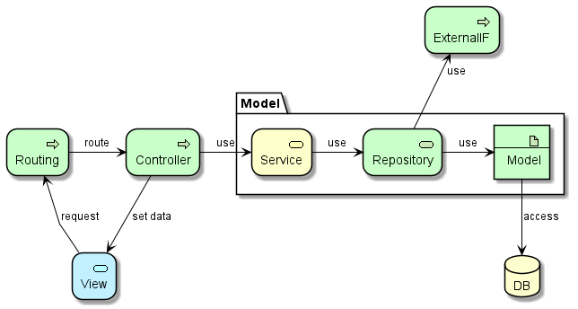

# Software Architecture
## Tiêu chuẩn và mục tiêu chuẩn hóa Software Architecture
+ Tạo điều kiện dễ dàng hơn để team có nhiều member cùng làm việc trên 1 dự án:
  + Các member đều hiểu logic nào nên được viết ở đâu
  + Các logic giống nhau được đặt ở trong cùng 1 class/package, tạo điều kiện dễ dàng cho việc common hóa logic giống nhau, tránh tạo ra nhiều logic gần giống nhau trong dự án
  + Đơn giản hóa việc review đảm bảo chất lượng, vì người review biết cần review nội dung gì ở đâu
+ Tạo điều kiện dễ dàng hơn trong việc maintenance hệ thống về sau
  +Khi thêm bớt chức năng thì kiến trúc của hệ thống không bị phá vỡ, không gây degrade
+ Tạo điều kiện dễ dàng hơn trong việc nâng cấp or chuyển đổi Framework
  + Phân chia rõ ràng những logic phụ thuộc vào Framework và logic độc lập với Framework (business logic), nhờ đó khi nâng cấp or chuyển đổi Framework thì vẫn dùng lại được phần logic business
+ Giúp team tập trung hơn vào việc code phần liên quan đến business logic bằng cách chuẩn hóa phần logic không liên quan đến Business Logic (chính là phần phụ thuộc vào Framework)

## Phương châm chuẩn hóa Software Architecture
Để thực hiện các tiêu chuẩn và mục tiêu chuẩn hóa Software Architecture ở trên, sẽ thực hiện chuẩn hóa Software Architecture theo phương châm sau:
+ Phân chia rõ vai trò nhiệm vụ của từng Layer
+ Chuẩn hóa logic phải viết trong những phần phụ thuộc vào FrameWork theo hướng giảm thiểu
  + Phần phụ thuộc vào Framework: Route, Controller, Repository, Model
  + Logic ngắn gọn nhất có thể
  + Tận dụng tool tự gen source code cho phần này nếu có thể
  + Tận dụng library của Framework cho những xử lý không liên quan đến Business Logic
  + Chuẩn hóa coding rule để có thể tham khảo copy từ đã có khi cần thêm chức năng mới
+ Business Logic tập trung trong Service layer, tạo điều kiện dễ dàng dùng lại khi nâng cấp Framework hoặc khi chuyển sang Framework khác cùng ngôn ngữ.
+ Tạo điều kiện dễ dàng cho maintenance về sau cũng như common hóa trong quá trình code

## Software Architecture Diagram
Với phương châm và mục tiêu nêu ra trong 2 phần trên, sẽ chia layer theo model MVC của Laravel trong đó phần Model chia nhỏ hơn thành các layer Service, Repository và Model như mô tả trong hình bên dưới:



### Routing

##### Role
+ Route request tới method tương ứng của Controller

##### Do:
+ Map uri với Middleware và Controller
+ Có thể kết hợp Controller tiếp nhận xử lý business với các middleware để xử lý request trước và sau xử lý của Controller (tham khảo: https://laravel.com/docs/9.x/middleware)

##### Don't:
+ Thực hiện logic không liên quan đến routing

### View

##### Role
+ UI/UX

##### Do:
+ Nhận input từ user rồi gửi request để route cho Controller thực hiện
+ Hiển thị data nhận được từ Controller

##### Don't:
+ Thực hiện business logic

##### Know:
+ Cách hiển thị kết quả xử lý lấy từ Controller lên màn hình: hiên thị ở đâu, theo format nào..

##### Don’t know:
+ Cách xử lý input và cách tạo ra output để hiển thị lên màn hình

### Controller
##### Role:
+ Nhận yêu cầu xử lý cùng input từ View rồi chuyển lại cho Service để thực hiện yêu cầu xử lý, sau đó chuyển kết quả xử lý cho View để hiển thị
+ Control việc di chuyển màn hình

##### Do:
+ Gọi method tương ứng của Service để thực hiện request từ View
+ Chuyển kết quả xử lý nhận được từ Service sang cho View

##### Don't:
+ Thực hiện các xử lý Business Logic
+ Thực hiện các xử lý access DB

##### Know:
+ Hiểu yêu cầu nhận được từ View (What to do)
+ Hiểu cần hiển thị data gì cho View (What to display)
+ Service nào có thể xử lý được yêu cầu (Who to dispatch)

##### Don't know:
+ Không biết chi tiết cách thực hiện yêu cầu (How)
+ Không biết cần lưu data vào đâu
+ Không biết cần lấy data từ đâu
+ Không biết thao tác với data thế nào để tạo ra kết quả

##### Sample codes:
Xử lý CRUD thuần
``` php
public function getSingleObjectInfo($searchParams)
{
    //1. call repository to get data
    $singleObjectData =
        $this->singleObjectService->getObjectInfoById($searchParams['id']);

    //return
    return $singleObjectData;
}
```

``` php
public function updateSingleObjectInfo($updateObjectData)
{
    //1. do validation
    $this->singleObjectService->checkObjectForUpdate($updateObjectData);

    //2. call repository to get data
    $updatedObjectData =
        $this->singleObjectService->updateSingleObjectInfo($updateObjectData);

    //return
    return $updatedObjectData;
}
```

Xử lý tổng hợp thông tin để hiển thị (không có xử lý update)
``` php
public function showComplicatedObjectInfo(ShowComplicatedObjectRequest $request)
{
    //1. convert data from request to DTO for service
    $searchParams = [
        'param1' => request->param1,
        'param2' => request->param2,
        'param3' => request->param3,
    ];
    //2. call service to get data
    $complicatedObjectData =
        $this->complicatedObjectService->getComplicatedObjectInfo($searchParams);

    //return View
    return view('complicatedObjectView', compact('complicatedObjectData'));
}
```

Xử lý phức tạp
``` php
public function processComplicatedLogic(ProcessComplicatedRequest $request)
{
    //1. convert data from request to DTO for service
    $processParams = [
        'param1' => request->param1,
        'param2' => request->param2,
        'param3' => request->param3,
    ];
    //2. call service to get data
    $processResult =
        $this->processComplicatedLogicService->processComplicatedLogic($processParams);

    //return View
    return view('processResultView', compact('processResult'));
}
```

##### Memos:
+ Theo nguyên tắc ĐƠN TRÁCH NHIỆM - Single responsibility principle (SRP), validation được thực hiện trong Request nên không đưa vào logic của Controller
+ Với public method, code làm sao để người đọc có thể nắm được flow xử lý. Vì vậy tránh code logic phức tạp trong public method. Nếu có xử lý phức tạp mà bắt buộc phải viết trên Controller thì tạo private method để thực hiện xử lý đó rồi call từ public method.
+ Không nên truyền trực tiếp request sang cho Service mà đổi sang data mà Service có thể hiểu (vì Service là nơi thực hiện Business Logic, không nên yêu cầu Service phải hiểu cấu trúc của Request vốn là nhiệm vụ của Controller)
+ Nếu cần thiết, có thể gọi private method để thực hiện việc convert data nhận được từ Service thành dạng data mà View hiểu được
+ Những xử lý sau nên chuyển cho Service thực hiện:
  + Xử lý tổng hợp nhiều data có liên hệ với nhau thành data lưu vào DB hoặc hiển thị trên View
  + Xử lý update data vào DB thông qua Repository
  + Xử lý thao tác với hệ thống bên ngoài thông Repository để gọi API

### Service
##### Role:
+ Thực hiện xử lý yêu cầu theo chỉ thị từ Controller

##### Do:
+ Dùng Repository để lấy data từ DB hoặc hệ thống ngoài
+ Thực hiện thao tác với data theo yêu cầu
+ Dùng Repository để lưu kết quả vào DB hoặc ra hệ thống bên ngoài
+ Trả kết quả thực hiện cho Controller


##### Don't:
+ Thực hiện access trực tiếp vào DB hoặc call External API (làm thông qua Repository)
+ Thực hiện các logic liên quan đến di chuyển màn hình (phần việc này là của Controller)
+ Thực hiện logic liên quan đến hiển thị kết quả lên View (Phần việc này Controller và View phối hợp thực hiện)

##### Know:
+ How to do: Hiểu spec để thực hiện yêu cầu nhận được từ Controller

##### Don't know:
+ Không biết data được lưu ở đâu (nhiệm vụ của Repository)
+ Không biết cần hiển thị gì trên màn hình (nhiệm vụ của Controller & View)

##### Sample codes:
Xử lý CRUD thuần
``` php
public function getSingleObjectInfo($searchParams)
{
    //1. call repository to get data
    $singleObjectData =
        $this->singleObjectRepo->getObjectInfoById($searchParams['id']);

    //return
    return $singleObjectData;
}
```

``` php
public function updateSingleObjectInfo($updateObjectData)
{
    //1. do validation
    $this->checkObjectForUpdate($updateObjectData);

    //2. call repository to get data
    $updatedObjectData =
        $this->singleObjectRepository->updateSingleObjectInfo($updateObjectData);

    //return
    return $updatedObjectData;
}
```

Xử lý tổng hợp thông tin để hiển thị (không có xử lý update)
``` php
public function getComplicatedObjectInfo($searchParams)
{
    //1. call repository to get data #1
    $searchParams1 = $searchParams['param1'];
    $objectData1 =
        $this->singleObjectRepository1->updateSingleObjectInfo($searchParams1);

    //2. call repository to get data #2
    $searchParams2 = $searchParams['param2'];
    $objectData2 =
        $this->singleObjectRepository2->updateSingleObjectInfo($searchParams2);

    //3. call repository to get data #3
    $searchParams3 = $searchParams['param3'];
    $objectData3 =
        $this->singleObjectRepository3->updateSingleObjectInfo($searchParams3);

    //4. combine data
    $complicatedObjectData =
        $this->combineObject(objectData1, objectData2, objectData3);

    //return result
    return $complicatedObjectData;
}
```

Xử lý phức tạp
``` php
public function processComplicatedLogic($processParams)
{
    //1. do validation
    $this->checkProcessParams($processParams);

    //2. do process step #1
    $processParams1 = $processParams['param1'];
    $processResult1 =
        $this->processBusinessLogic1($processParams1);

    //3. do process step #2
    $processParams2 = $searchParams['param2'];
    $processResult2 =
        $this->processBusinessLogic2($processParams2);

    //4. do process step #3
    $processParams3 = $searchParams['param3'];
    $processResult3 =
        $this->processBusinessLogic3($processParams3);

    //5. save the processResult
    $this->saveProcessResult(
                    $processResult1,
                    $processResult2,
                    $processResult3);

    //6. create process result
    $processResult = $this->combineProcessResult(
                    $processResult1,
                    $processResult2,
                    $processResult3);

    //return
    return $processResult;
}
```

Xử lý có gọi API hệ thống ngoài
``` php
public function registerNewUser($userData)
{
    //1. do validation
    $this->checkObjectForUpdate($userData);
    //2. save user with mailSent status = 'Sending'
    // the status will be updated to 'Sent' when the mail is sent
    $userData['mailSent'] = 'Sending';
    $savedUser = $this->userRepository->create($userData);
    //3. create sendmail job
    $this->createSendMailJob($userData);

    //return
    return $savedUser;
}
```
``` php
private function createSendMailJob($userData) {
    //1. create mail data
    $mail = [
        'from'    => 'admin@hoge.com',      //replace with system email
        'f_name'  => 'Admin',               //replace with system email
        'to'      => $userData['email'],
        'to_name' => $userData['name'],
        'subject' => 'Thanks for your registration.'
    ];
    //2. create job queue
    $job = new SendMail($mail);
    //3. ad job to jobs table
    $this->dispatch($job);
    //return job
    return $job;
}
```

##### Memos:
+ Với public method, code làm sao để đọc method có thể nắm được flow xử lý của method đó
+ Tạo private method để thực các xử lý check …
  + Logic check trong Service chỉ apply cho các check phức tạp liên quan đến nhiều object hoăc nhiều loại data. Với check đơn giản thì đưa vào Request.
+ Nên tạo private method cho mỗi block xử lý trong flow xử lý, trừ khi xử lý đó rất đơn giản có thể thực hiện trong 1 câu lệnh đơn giản, hoặc có thể giao hoàn toàn cho các Helper hoặc Repository
+ Nên code xử lý của public method theo flow (*):
  + Check input (optional, chỉ cần khi có check phức tạp)
  + Tổng hợp output data từ input data & DB (chưa save và DB vội)
  + Lưu output save vào DB
  + Tạo result để return cho Controller từ output ở trên
+ Với những xử lý vừa có logic lưu data vào DB, vừa có logic gọi API của hệ thống ngoài, thì nên dùng Queue (**) của Laravel để thực hiện xử lý gọi API của hệ thống bên ngoài. Lý do:
  + Xử lý call API của hệ thống ngoài dễ bị lỗi, do kết nối mạng, do data có thể bị thay đổi mà phía hệ thống đang develop không control hết được
  + Việc dùng Queue để xử lý sẽ tạo điều kiện dễ dàng cho logic retry, đồng thời đảm bảo không gây phát sinh timeout khi gọi API.
  + Xử lý gọi API của hệ thống ngoài thường chậm, sẽ kéo dài nếu thêm cả xử lý retry. Nếu đợi hệ thống ngoài xử lý xong mới kết thúc xử lý theo yêu cầu của user có thể dẫn đến việc user phải chờ quá lâu, không thỏa mãn yêu cầu về usability của hệ thống
+ Nếu có gọi API hệ thống ngoài, tùy vào business mà thiết kế status ứng với kết quả xử lý gọi API
  + Status này được update cả khi tạo job và trong logic xử lý của job để hệ thống có thể biết được xử lý của job có thành công hay không
  + Có thể cần thêm chức năng xử lý recovery nếu có lỗi khi gọi API bên ngoài, bởi vì có nhiều trường hợp phức tạp có thể phát sinh mà hệ thống không thể tự recovery
  + Thông thường cần thiết lập settings để có xử lý retry trong Job Queue

+ Các xử lý liên quan đến access Data hoặc gọi API bên ngoài thì giao cho Repository xử lý
+ Hạn chế không access trực tiếp vào Model (là nhiệm vụ của Repository)

(*) Lý do là nếu vừa tạo data vừa lưu luôn, có khả năng đến xử lý gần cuối cùng mới phát hiện có lỗi, khi đó xử lý sẽ bị kéo dài và có khả năng phải rollback lại những xử lý trước đó.
(**) Tham khảo thêm https://laravel.com/docs/9.x/queues khi code các logic liên quan đến Queue.

### Repository
##### Role:
+ Giúp Service thực hiện các xử lý access data thông qua Model hoặc gọi API ngoài

##### Know:
+ Biết nên access data nào, ở đâu (How to access to data)

##### Don't know:
+ Không hiểu business, không biết phải xử lý data như thế nào (nhiệm vụ của Service)

##### Do:
+ Thực hiện CRUD với DB thông qua Model hoặc gọi API ngoài

##### Don't:
+ Thực hiện các xử lý Business Logic

##### Sample codes:
``` php
public function getObjectInfoById($id)
{
    return SampleModel::where('id', $id)->first();
}
```
``` php
public function updateSingleObjectInfo($updateObjectData)
{
    return SampleModel::update($updateObjectData);
}
```

##### Memos:
+ Thực hiện các xử lý tổng hợp data theo mối quan hệ giữa các data (quan hệ 1-1, quan hệ cha-con…)
+ Không đưa các xử lý data phức tạp liên quan đến Business Logic vào Repository

### Model
##### Role:
+ Thực hiện access với DB
##### Know:
+ Cấu trúc data
##### Don't know:
+ Không hiểu business, không biết phải xử lý data như thế nào (nhiệm vụ của Service)
##### Do:
+ Access DB thông qua library của Framework
##### Don't:
+ Xử lý Business Logic
+ Xử lý data phức tạp (chỉ thực hiện mapping và các xử lý được Framework hỗ trợ)
